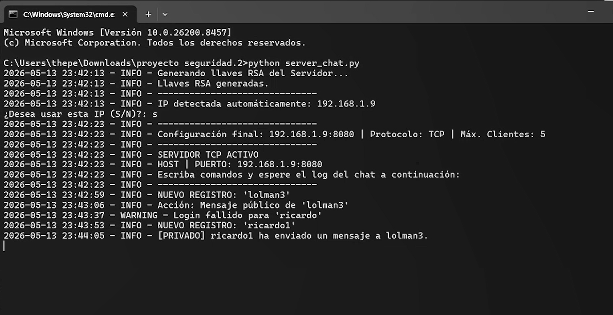

# Seguridad-informatica-chat

## Funcionalidad principal
* Arquitectura Cliente-Server: soportando hasta un maximo de 5 usuario simultaneamente
* Sala publicas con chat privado: los usuarios pueden enviar mensajes publicamente y enviar mensajes privas a ciertos usuarios
* Administracion: el servidos cuenta con comandos para gestionar la sala tales como, expulsar usuario, banear IP, banear Usuario, etc)
* Registro persistente: Sistema de login y registro que persiste para usos futuros

Caracteristicas de Seguridad
* Cifrado Asimetrico (RSA) intercambio dinamico de llaves publicas y privadas: toda comunicacion viaja de forma cifrada por la red, los mensajes privados quedan privados en el registro 
* Hashing y salting: las contraseñas no se guardan en texto plano, si no en un hasheo con salting aleatorio de 16 caracteres apra evitar colisiones
* Mitigacion de inyeccion: sanitizacion estricta de entradas, bloqueos de caracteres, espacios nulos y delimitadores para evitar inyeccion
* Auditoria: registro de eventos del servidor, estructurado por eevento, usuario e IP


## Instalacion y ejecucion
**Prerrequisitos:**
* Python 3.x instalado.
* Librería `rsa` instalada. Puedes instalarla ejecutando:
    ```
    pip install rsa
    ```

**Pasos para ejecutar:**
1.  Inicia el servidor ejecutando en una terminal:
    ```
    python servidor.py
    ```
2.  El servidor detectará tu IP automáticamente. Confírmala.
3.  Abre terminales nuevas (ya sea en este dispositivo u otro, con la condicion de que esten en la misma red) por cada cliente que desees conectar y ejecuta:
    ```bash
    python cliente.py
    ```
4.  Ingresa la IP del servidor y sigue el menú en pantalla para registrarte o iniciar sesión.

---

## Demostracion de uso
Click a la captura para entrar al video de youtube

[](https://youtu.be/Y1agrKqobvc)


## Comandos Disponibles

**Para el Cliente:**
* `/msg [usuario] [mensaje]` -> Envía un mensaje privado.
* `salir` -> Desconecta la sesión de manera segura.

**Para el Servidor (Administrador):**
* `comandos` -> Muestra la ayuda.
* `/list` -> Lista los clientes activos.
* `/kick [usuario]` -> Desconecta a un usuario.
* `/banip [ip]` -> Bloquea una IP permanentemente.
* `/banuser [usuario]` -> Prohíbe un nombre de usuario.
* `/exit` -> Apaga el servidor.

---


## Equipo de Desarrollo
-Ricardo Perez Rubio
-Neil Parker Llamas
